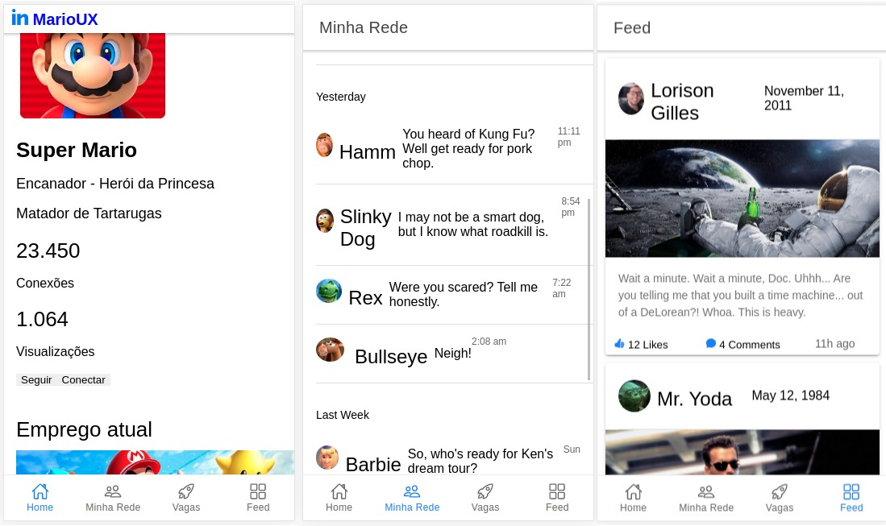
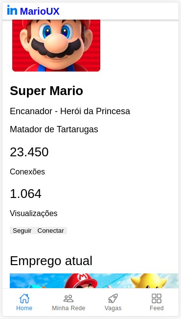
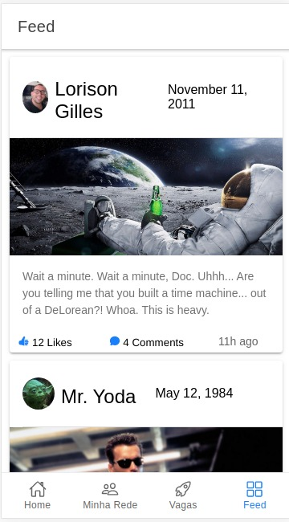

<h1 align="center">
    
</h1>

<h1 align="center">
   <a href="#"> Mario-Art </a>
</h1>

<h3 align="center">
    App desenvolvido para treinar Ionic e suas propriedades.
</h3>

<p align="center">
  

  

<!-- Twitter -->
  <!-- <a href="https://www.twitter.com/Gilles30/">
    
  </a> -->

  <a href="https://github.com/Gilles30/mario-art/commits/master">
    
  </a>
    
   
   <a href="https://github.com/Gilles30/mario-art/stargazers">
    
  </a>

  <a href="https://github.com/Gilles30">
    
  </a>
  
 
</p>

<h4 align="center"> 
	 Status: Em andamento.
</h4>

<p align="center">
 <a href="#about">About</a> •
 <a href="#features">Features</a> •
 <a href="#layout">Layout</a> • 
 <a href="#how-it-works">How it works</a> • 
 <a href="#tech-stack">Tech Stack</a> • 
 <a href="#contributors">Contributors</a> • 
 <a href="#author">Author</a> • 
 <a href="#user-content-license">License</a>

</p>

## Sobre

:neckbeard: Mario-art - é um aplicativo desenvolvido com a ionic, uma rede social do Sr. Mario [Mario-Art](https://github.com/Gilles30/mario-art/).

---

## Features

- [x] Estrutura de código, Mario pode:

  - [x] Estrutura de código, Mario pode
  - [x] Ver novos empregos
  - [x] Siga seu feed, com notícias postadas por membros de sua rede

---

## Layout

O layout do aplicativo está disponível no Figma:

<p align="center">
  :construction:
</p>

<!-- <a href="https://www.figma.com/file/1SxgOMojOB2zYT0Mdk28lB/Ecoleta?node-id=136%3A546">
  
</a> -->

### Mobile

<p align="center">
  

  
</p>

---

## Como funciona

Este projeto está dividido em duas partes:

1. Backend (pasta do servidor) (em construção)
2. Celular (pasta móvel)

IONIC

Tanto o Frontend quanto o Mobile não precisam do Backend para funcionar (sem funcionalidade de banco de dados)

### Pre-requisitos

Antes de começar, você precisará ter as seguintes ferramentas instaladas em sua máquina:
[Git] (https://git-scm.com), [Node.js] (https://nodejs.org/en/).
Além disso, é bom ter um editor para trabalhar com o código como [VSCode] (https://code.visualstudio.com/)

#### Executando o Backend (servidor)

```bash

# Clone este repositório
$ git clone git@github.com:Gilles30/mario-art.git

# Acesse a pasta do projeto cmd / terminal
$ cd mario-art

# vá para a pasta do servidor
servidor $ cd

# instale as dependências
$ npm install ou yarn

# Execute o aplicativo em modo de desenvolvimento
$ npm run dev: server ou yarn server: dev

# O servidor irá iniciar na porta: 3333 - vá para http: // localhost: 4201

```

<p align="center"> #:construction:
  <a href="https://github.com/Gilles30/mario-art/blob/master/Insomnia_API_mario-artjson.json" target="_blank"></a>:construction:
</p>

#### Executando o aplicativo web (Frontend)

```bash

# Clone este repositório
$ git clone git@github.com:Gilles30/mario-art.git

# Acesse a pasta do projeto em seu terminal
$ cd mario-art

# Vá para a pasta do aplicativo Front End
$ cd web

# Instale as dependências
$ npm install ou yarn

# Execute o aplicativo em modo de desenvolvimento
$ npm run start ou yarn start

# O aplicativo será aberto na porta: 3000 - vá para http: // localhost: 4200

```

---

## Tech Stack

As seguintes ferramentas foram utilizadas na construção do projeto:

### **Website** ([Ionic](https://ionic.com/) + [TypeScript](https://www.typescriptlang.org/))

- **[Ionic](https://github.com/ionic-team/ionic-framework)**
- **[Ion Icons.github](https://github.com/ionic-team/ionicons)**
- **[Angularjs](https://angularjs.org/)**
- **[Ion Icons](https://ionicons.com/)**

> See the file [package.json](https://github.com/Gilles30/mario-art/blob/master/package.json)

_:construction:_

#### [](https://github.com/Gilles30/mario-art#server-nodejs--typescript)**Server** ([NodeJS](https://nodejs.org/en/) + [TypeScript](https://www.typescriptlang.org/))

- **[Express](https://expressjs.com/)**
- **[CORS](https://expressjs.com/en/resources/middleware/cors.html)**
- **[KnexJS](http://knexjs.org/)**
- **[SQLite](https://github.com/mapbox/node-sqlite3)**
- **[ts-node](https://github.com/TypeStrong/ts-node)**
- **[dotENV](https://github.com/motdotla/dotenv)**
- **[Multer](https://github.com/expressjs/multer)**
- **[Celebrate](https://github.com/arb/celebrate)**
- **[Joi](https://github.com/hapijs/joi)**

> See the file [package.json](https://github.com/Gilles30/mario-art/blob/master/server/package.json)

#### [](https://github.com/Gilles30/mario-art#mobile-ionic--typescript)**Mobile** ([Ionic](http://www.ionic.com/) + [TypeScript](https://www.typescriptlang.org/))

- **[Expo](https://expo.io/)**
- **[Expo Google Fonts](https://github.com/expo/google-fonts)**
- **[Ionic Navigation=](https://ionic.com/)**
- **[Expo Constants](https://docs.expo.io/versions/latest/sdk/constants/)**
- **[Axios](https://github.com/axios/axios)**
- **[Expo Location](https://docs.expo.io/versions/latest/sdk/location/)**
- **[Expo Mail Composer](https://docs.expo.io/versions/latest/sdk/mail-composer/)**

> See the file [package.json](https://github.com/Gilles30/mario-art/blob/master/mobile/package.json)

#### [](https://github.com/Gilles/mario-art#utilit%C3%A1rios)**Utilitários**

- Prototype: **[Figma](https://www.figma.com/)** → **[Protótipo (Mario-art)](in progress)**

---


## Colaboradores

Um grande obrigado a este grupo de pessoas que me ajudaram com ensino e conhecimento e ao meu mentor (Wezss) que fez minha curva de aprendizado quase 90 ° :)

Vocês são profissionais incríveis! :)

<table>
  <tr>
    <td align="center"><a href="https://rocketseat.com.br"><br /><sub><b>Diego Fernandes</b></sub></a><br /><a href="https://rocketseat.com.br/" title="Rocketseat"></a></td>
    <td align="center"><a href="https://rocketseat.com.br"><br /><sub><b>Cleiton Souza</b></sub></a><br /><a href="https://rocketseat.com.br/" title="Rocketseat"></a></td>
    <td align="center"><a href="https://rocketseat.com.br"><br /><sub><b>Robson Marques</b></sub></a><br /><a href="https://rocketseat.com.br/" title="Rocketseat"></a></td>
    <td align="center"><a href="https://github.com/wezss"><br /><sub><b>Wezss</b></sub></td>
    
  </tr>
  <tr>
    <td align="center"><a href="https://rocketseat.com.br"><br /><sub><b>Joseph Oliveira</b></sub></a><br /><a href="https://rocketseat.com.br/" title="Rocketseat"></a></td>
    <td align="center"><a href="https://rocketseat.com.br"><br /><sub><b>Guilherme Rodz</b></sub></a><br /><a href="https://rocketseat.com.br/" title="Rocketseat"></a></td>
    <td align="center"><a href="https://rocketseat.com.br"><br /><sub><b>Mayk Brito</b></sub></a><br /><a href="https://rocketseat.com.br/" title="Rocketseat"></a></td>
    <td align="center"><a href="https://rocketseat.com.br"><br /><sub><b>João Paulo</b></sub></a><br /><a href="https://rocketseat.com.br/" title="Rocketseat"></a></td>
    
  </tr>
</table>

## Como contribuir

1. Faça um fork do projeto.
2. Crie um novo branch com suas alterações: `git checkout -b my-feature`
3. Salve suas alterações e crie uma mensagem de confirmação dizendo o que você fez: `git commit -m" feature: My new feature "`
4. Envie suas alterações: `git push origin my-feature`
   > Se você tiver alguma dúvida, consulte este [guia sobre como contribuir] (./CONTRIBUTING.md))

---

## Autor

<a href="https://app.rocketseat.com.br/me/lorison-gilles-02226">
 
 <br />
 <sub><b>Lorison Gilles</b></sub></a> <a href="https://app.rocketseat.com.br/me/lorison-gilles-02226/" title="Rocketseat"></a>
 <br />

[](https://www.linkedin.com/in/lorison-gilles/)
[](mailto:lorison.gilles@gmail.com)

---

## Licença

Este projeto está sob a licença [MIT] (./ LICENSE).

Feito com amor por Lorison Gilles 👋🏽 [Get in Touch!](Https://www.linkedin.com/in/lorison-gilles/)

---

## Versões do README

[Portuguese](./README.md) | [English without emojis](./README-en.md)
